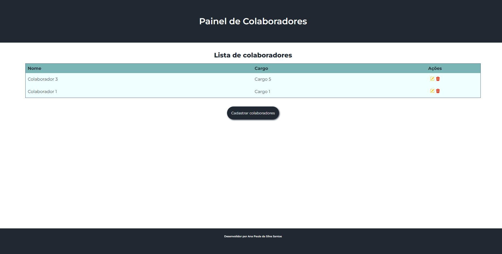

# Painel de Colaboradores

## Sobre ( About )
Este projeto foi realizado durante o programa de formação front-end Afrocódigos.

Este projeto foi gerado com a [Angular CLI](https://github.com/angular/angular-cli) versão 17.3.7.

**English:**

This project was carried out during the Afrocódigos front-end training program.

This project was generated with [Angular CLI](https://github.com/angular/angular-cli) version 17.3.7.

## Captura de tela ( Screenshot )

## Instalação ( Installation )

1. Baixe o código
2. Abra o terminal no VS code
3. Execute o comando: `npm i`
4. Rode usando: `npm start`
5. Abra o navegador e acesse `http://localhost:4200/`

**English:**

1. Download the code
2. Open the terminal in VS Code
3. Run the command: `npm install`
4. Run the application: `npm start`
5. Open your browser and go to `http://localhost:4200/`